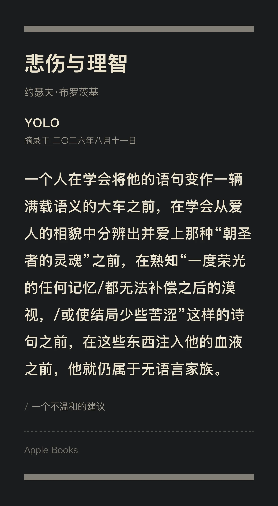
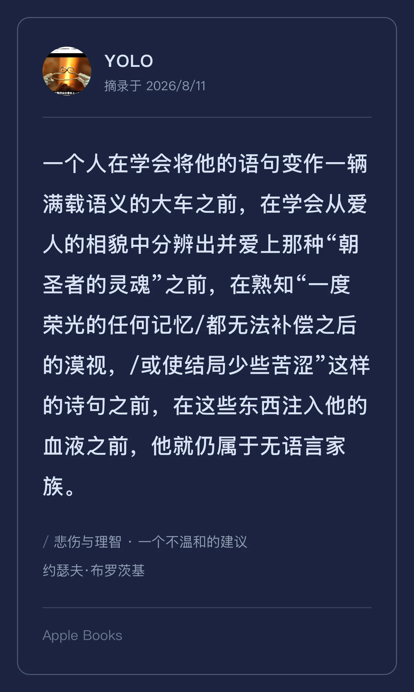
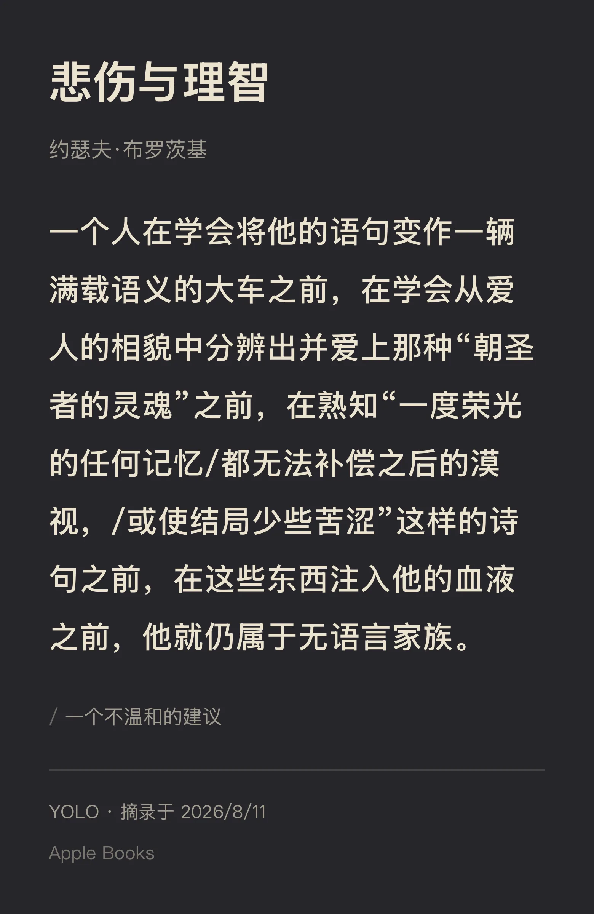

# 书摘 Excerpt Studio

本地离线的书摘分享卡片生成器 —— 微信读书风格，一段文字 + 元数据，导出像素级高清 PNG。

100% 客户端渲染，无服务端、无账号、无网络请求。原生外壳（Tauri）只负责 Web 拿不到的两件事：
调起系统保存对话框写盘、在 Finder 里定位导出的文件。


## 功能

- 居中画布实时预览，就地编辑正文 / 书名 / 作者 / 章节等卡片元素
- 5 套版式 × 12 套配色 × 图片背景三轴独立，各自记忆
- 中文六档 + 西文五档系统字体，运行时探测本机是否装有对应字体
- 一键导出高清 PNG，支持自定义倍率

## 效果预览

| 经典 | 日历 | 墨白 |
|---|---|---|
|  |  |  |

| 手札 | 锦书 |
|---|---|
|  |  |

## 环境要求

- macOS（打包脚本仅支持 Darwin；开发模式理论上可在其他平台跑 Tauri，未做适配验证）
- Node.js >= 20
- Rust 工具链（`rustup`）
- Xcode Command Line Tools（`codesign` / `hdiutil` / `plutil`，用于本地打包签名）

## 开发

```bash
npm install
npm run tauri:dev
```

仅调试前端（不含原生外壳）：

```bash
npm run dev
```

## 测试

```bash
npm test
```

串联正文编辑器、共享状态迁移、排版设置的回归测试，并跑一遍生产构建。

## 打包（macOS）

```bash
npm run tauri:build
```

调用 `script/package_macos.sh`：生成中间态 `.app`，将 ad-hoc 签名的 designated requirement
固定为 bundle id 后封装 DMG，避免裸签名在重新构建后被系统当成新 App。产物在
`src-tauri/target/release/bundle/`。

## 架构

渲染核心藏在 `render/Renderer` 接口后（依赖倒置）：当前实现基于 `html-to-image`，
如果 WebKit 保真度出问题，可以换成 Canvas 实现而不动上层调用方。

更详细的模块地图见各目录下的 `CLAUDE.md`；产品与技术决策的完整推导过程见 [ANALYSIS.md](./ANALYSIS.md)。

## 许可证

[MIT](./LICENSE)
